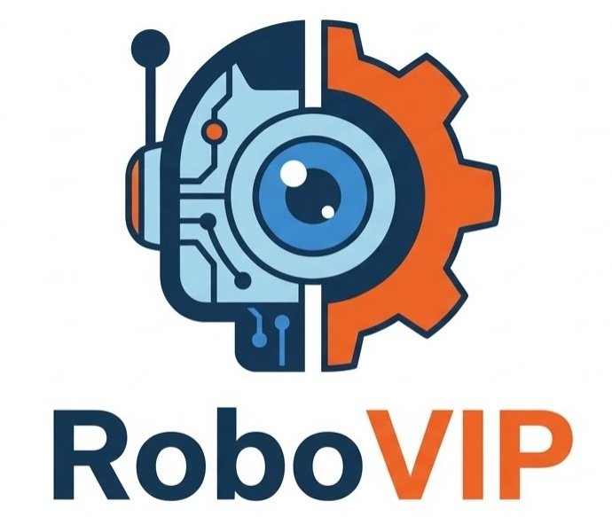

    

# RoboVIP: Multi-View Video Generation with Visual Identity Prompting Augments Robot Manipulation

We propose RoboVIP, a multi-view inpainting-based video diffusion model with identity reference as conditions to augment robotics manipulation data in both simulation and real-world robot setup. 

🔥 [Update](#Update)  **|** 🔧 [Installation](#installation) **|**  💻 [Inference Augmentation](#evaluation) **|** 🧩 [Dataset Preprocessing](#dataset_curation)  **|** 🔥[Train](#training)  

<!-- 👀 [**Visualization**](#Visualization)  -->

#  Update 🔥🔥🔥
- [x] Release the paper
- [ ] Release the Video Diffusion Model weights and Inference Code
- [ ] Less GPU memory intense version (<80GB) of Bridge RLDS
- [ ] Release the preprocessing code of the dataset
- [ ] Release the training code for the Video Diffusion Model
- [ ] Release the simulation testing
- [ ] Release the training code for simulation

:star: **If you like RoboVIP, please help ⭐⭐star⭐⭐ this repo. Thanks!** :hugs:

Under Review.

 

# Citation 📚 
TBD

 

# Acknowledgment 🤗 
**RoboVIP** is built on [diffusers](https://github.com/huggingface/diffusers) and [RoboEngine](https://github.com/michaelyuancb/roboengine).
We appreciate the authors for sharing their awesome codebase.

